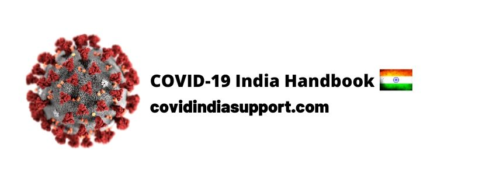

# COVID-19 India Handbook

**This project is modeled based on the** [**Coronavirus Tech Handbook**](https://coronavirustechhandbook.com/) ****

## **Goals**

* Serve as a repository of COVID-19 related regional efforts in India and make these efforts easily discoverable and searchable. 
* Help communities self-organise into [viral kindness groups](https://viralkindness.imfast.io/). 
* Assist in crisis management and response by building simple tools \(e.g. [Resource Tracke](https://tracker.imfast.io/)r, [Help A Stranger \(demo version available\)](http://help-a-stranger.epizy.com/index.php)\).  

## Table of Contents























| Resources |
| :---: |
| **Follow us on our social media pages:**  [**Instagram**](http://instagram.com/covid_india_support) **,** [**Facebook**](http://facebook.com/covidindiasupport) **** |
| **Want to Contribute?** [**Here’s How**](https://docs.google.com/document/d/1GLNnpri3W2D4g8LNaJ88XpedSRVUH4t97KV5WfCy6UI/edit) |
| **Wondering who we are?** [**About u**](https://docs.google.com/document/d/1gz8P_C_TdyveJz3UoKB-J4UXtEBNt4U96zek3V_0FNI/edit?usp=sharing)**s** |
| **Discuss the project:** [**S**](https://join.slack.com/t/covid-19indiasupport/shared_invite/zt-d0qjoovn-4VE2rEaVmKqY84TrTMIxug)[**lack channel**](https://join.slack.com/t/covid-19indiasupport/shared_invite/zt-d0qjoovn-4VE2rEaVmKqY84TrTMIxug)  |
| **Try our** [**Mobile app**](https://covidindia.glideapp.io/) **\(beta\)** |

| **Read about us** |
| :--- |
| \*\*\*\*[https://www.reddit.com/r/india/comments/fjhhjv/calling\_volunteers\_covid19\_india\_support\_handbook/](https://www.reddit.com/r/india/comments/fjhhjv/calling_volunteers_covid19_india_support_handbook/) |
| [https://www.reddit.com/r/india/comments/fmvkyz/calling\_volunteers\_covid19\_viral\_kindness\_groups](https://www.reddit.com/r/india/comments/fmvkyz/calling_volunteers_covid19_viral_kindness_groups/) |


**Disclaimer**

This website and our viral kindness groups may contain information about medical conditions and treatments. The information is not advice, and should not be treated as such. We bear no responsibility for any decisions or actions taken resulting from information found in these resources, nor do we claim that any of it is complete, true, accurate, up-to-date, or non-misleading. Use and re-use it at your own risk!


